# 📦 Pinjemin

**Pinjemin** adalah aplikasi web inovatif yang menggabungkan fitur e-commerce dan penyewaan barang dalam satu platform. Dengan satu akun, pengguna dapat **menyewakan, meminjam, dan membeli** barang secara fleksibel dan efisien. Aplikasi ini dirancang untuk menciptakan ekosistem jual-beli dan sewa yang **user-friendly**, aman, dan mendukung transaksi berbasis lokasi secara langsung.

---

## 🚀 Fitur Unggulan

- 🔐 **Satu Akun untuk Semua** – Satu akun bisa digunakan untuk mengunggah produk, menyewa, membeli, dan melakukan checkout.
- 📤 **Upload Produk Fleksibel** – Pengguna dapat menawarkan barang untuk **dijual**, **disewakan**, atau keduanya.
- 🛒 **Checkout Terintegrasi** – Proses checkout mendukung transaksi **jual-beli dan sewa secara bersamaan**.
- 🤝 **Transaksi COD (Cash on Delivery)** – Pembayaran dilakukan secara langsung saat penyerahan barang.
- 📜 **Riwayat & Notifikasi Transaksi** – Semua aktivitas pengguna tercatat, dilengkapi dengan **notifikasi real-time**.
- 🌟 **Penilaian & Ulasan Pengguna** – Fitur rating dan review untuk meningkatkan kepercayaan antar pengguna.
- 💬 **Komentar & Obrolan Langsung** – Komunikasi langsung antar pengguna dalam satu platform.
- 📍 **Lokasi & Janjian Pengambilan** – Tentukan tempat dan waktu pengambilan/penyerahan barang dengan mudah.
- ⏰ **Pengingat Pengembalian Otomatis** – Sistem akan memberikan notifikasi saat batas waktu penyewaan mendekat.
- 🔍 **Pencarian Cerdas** – Fitur pencarian dengan filter detail untuk memudahkan pengguna menemukan barang sesuai kebutuhan.
- 🗺️ **Peta Interaktif Real-Time** – Navigasi berbasis peta untuk memudahkan pencarian lokasi pengguna atau produk.

---

## 👥 Tim Pengembang

### 🎯 Machine Learning Team

- **MC008D5X0402** – Rahma Nur Annisa  
  *Statistika, Universitas Gadjah Mada*

- **MC008D5Y0259** – Yohanes De Britto Dewo Prasetyo  
  *Statistika, Universitas Gadjah Mada*

- **MC008D5Y1074** – Dimaz Andhika Putra  
  *Statistika, Universitas Gadjah Mada*

### 🖥️ Front-End & Back-End Team

- **FC221D5Y1035** – Bintang Kurniawan Herman  
  *Ilmu Komputer, UIN Sumatera Utara Medan*

- **FC134D5X1508** – Indah Sari Sitorus  
  *Manajemen Informatika, Politeknik Negeri Sriwijaya*

- **FC014D5Y0292** – I Putu Yogi Prasetya Dharmawan  
  *Teknologi Informasi, Universitas Udayana*

---

## 📂 Repositori GitHub

- **Front-End**: [github.com/bintangawan/frontend-pinjemin](https://github.com/bintangawan/frontend-pinjemin)  
- **Back-End**: [github.com/bintangawan/backend-pinjemin](https://github.com/bintangawan/backend-pinjemin)  
- **Machine Learning**: [github.com/bintangawan/backend-ml-pinjemin](https://github.com/bintangawan/backend-ml-pinjemin.git)  
- **Machine Learning Express**: [github.com/bintangawan/exml-pinjemin](https://github.com/bintangawan/exml-pinjemin.git)

---

## 📱 Tampilan Aplikasi

### 🏠 Landing Page  

  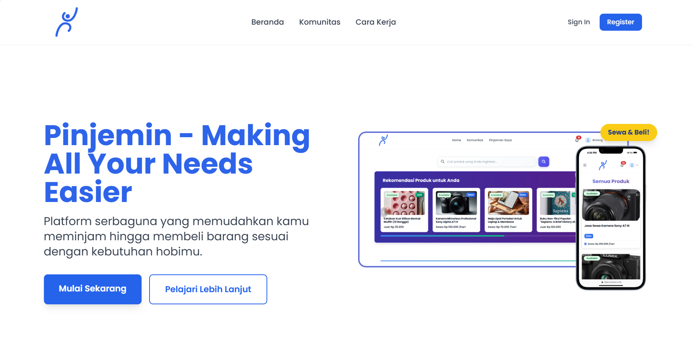

  
Halaman awal aplikasi yang menampilkan informasi utama tentang fitur, manfaat, dan ajakan untuk mendaftar atau masuk. Desain menarik untuk menarik perhatian pengguna sejak pertama kali mengakses.

---

### 📝 Register  

  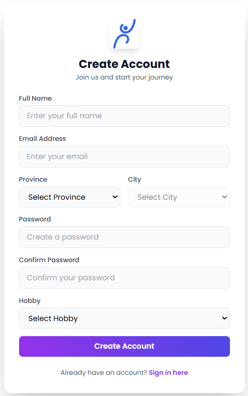

  
Formulir pendaftaran akun baru dengan antarmuka ramah pengguna. Mendukung pendaftaran melalui email maupun akun media sosial.

---

### 🔑 Login  

  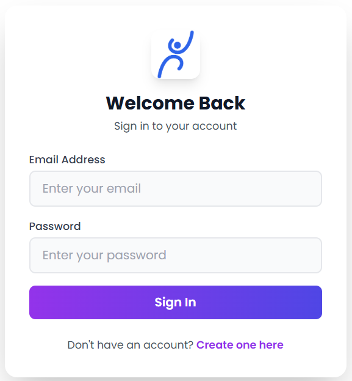

  
Tampilan login yang sederhana namun aman, memberikan akses cepat ke akun pengguna.

---

### 🏠 Home Page  

  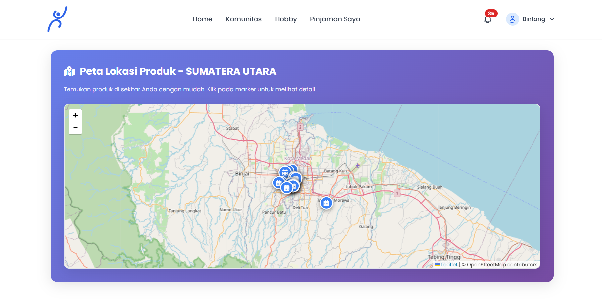

  
Dashboard utama yang menampilkan produk populer, kategori, dan rekomendasi personal. Navigasi intuitif memudahkan pengguna menjelajahi fitur yang tersedia.

---

### 🔍 Search & Product Recommendation  

  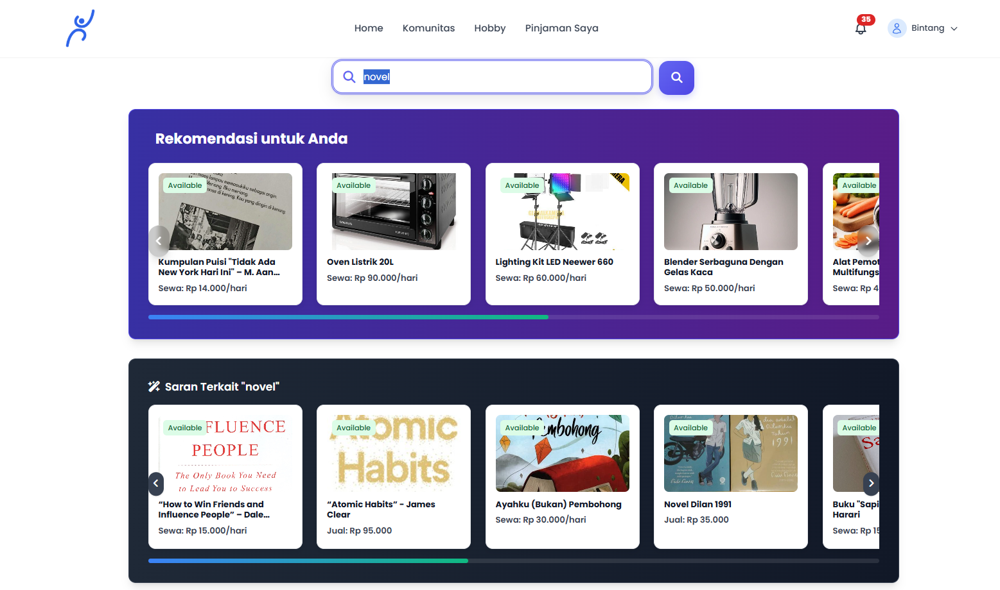

  
Pencarian pintar dengan filter lengkap berdasarkan kategori, lokasi, harga, dan ketersediaan. Dilengkapi rekomendasi produk yang dipersonalisasi menggunakan algoritma machine learning.

---

### 📦 Detail Item  

  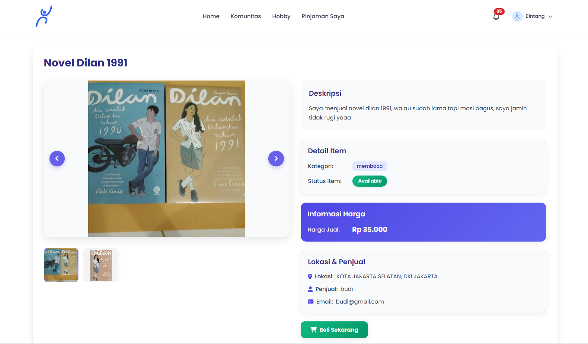

  
Menampilkan informasi lengkap produk, termasuk deskripsi, harga beli/sewa, durasi, kondisi barang, serta ulasan dari pengguna sebelumnya.

---

### 🧩 Product Recommendation  

  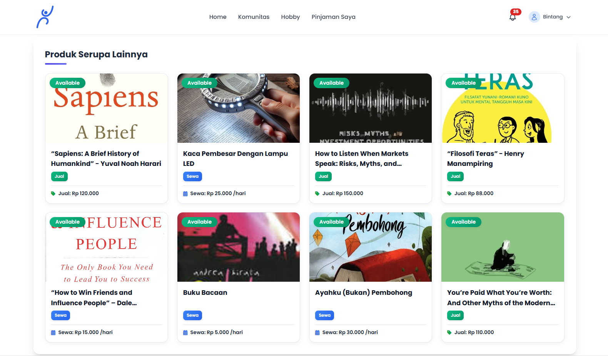

  
Fitur rekomendasi lanjutan yang menyarankan produk sejenis atau pelengkap berdasarkan aktivitas pengguna sebelumnya.

---

### 👥 Community  

  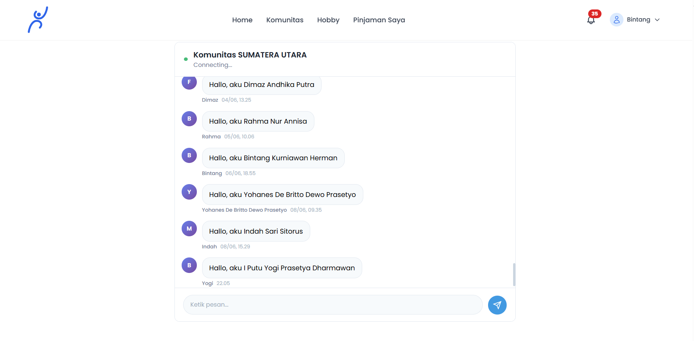

  
Forum komunitas tempat pengguna dapat saling berdiskusi, berbagi pengalaman, dan membangun relasi dalam ekosistem Pinjemin.

---

### 🎯 Hobby  

  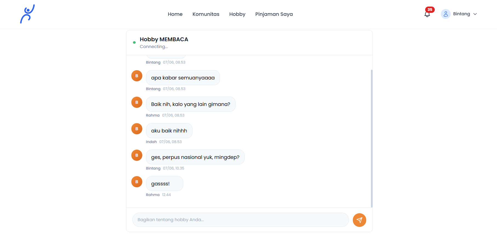

  
Koleksi produk berdasarkan minat dan hobi pengguna, memudahkan pencarian barang sesuai kegemaran pribadi.

---

### ➕ Add Item  

  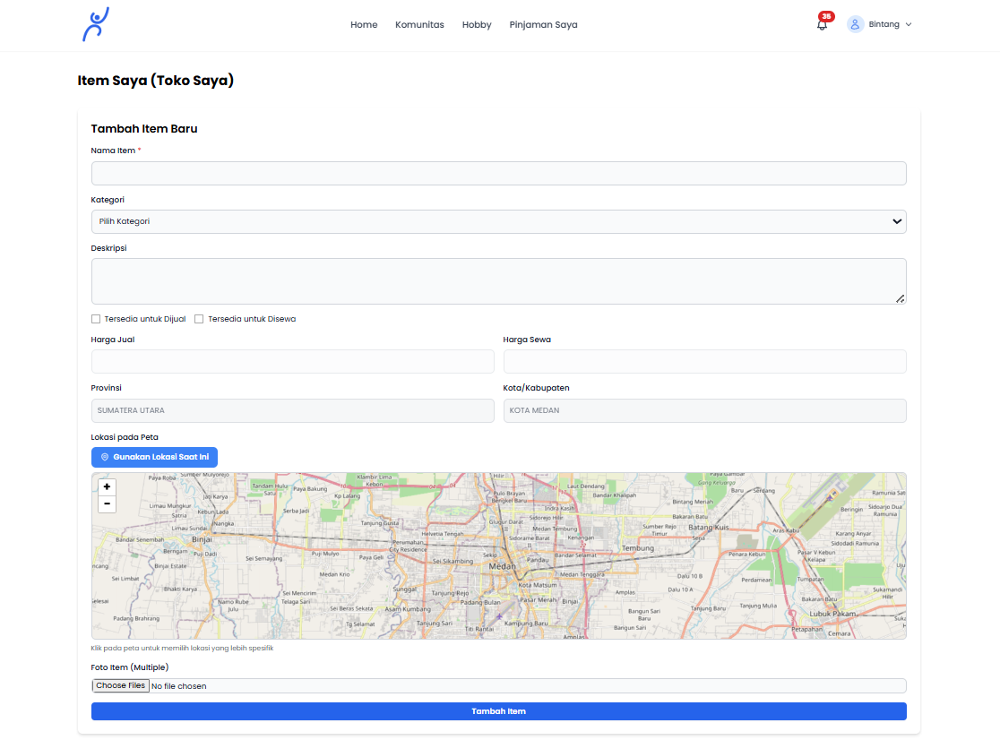

  
Formulir unggah produk yang ringkas dan jelas. Pengguna dapat menentukan apakah barang akan disewakan, dijual, atau keduanya.

---

### 📋 Daftar Item  

  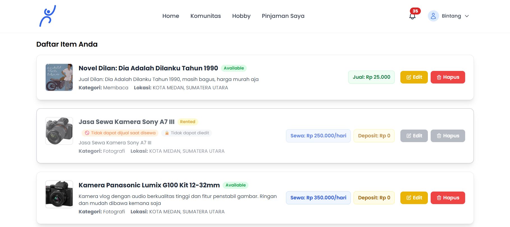

  
Inventaris pribadi pengguna, menampilkan status masing-masing barang (tersedia, disewa, terjual) dengan kontrol edit dan hapus.

---

### 🛒 Buyer Page  

  

  
Dashboard khusus pembeli, menampilkan riwayat transaksi, status pesanan, serta jadwal pengambilan dan pengembalian.

---

### 💼 Seller Page  

  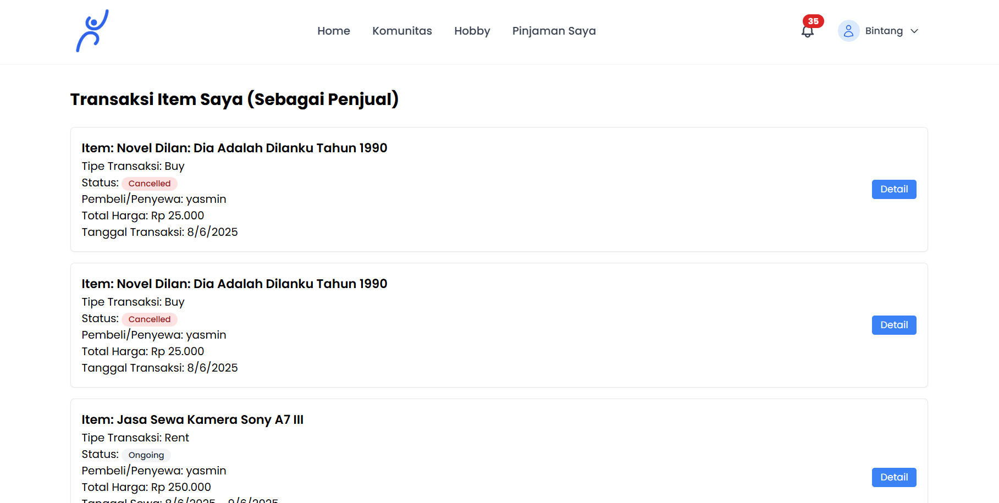

  
Panel untuk penjual yang berisi statistik, permintaan pembeli/penyewa, serta notifikasi terkini.

---

### 👤 Profile Page  

  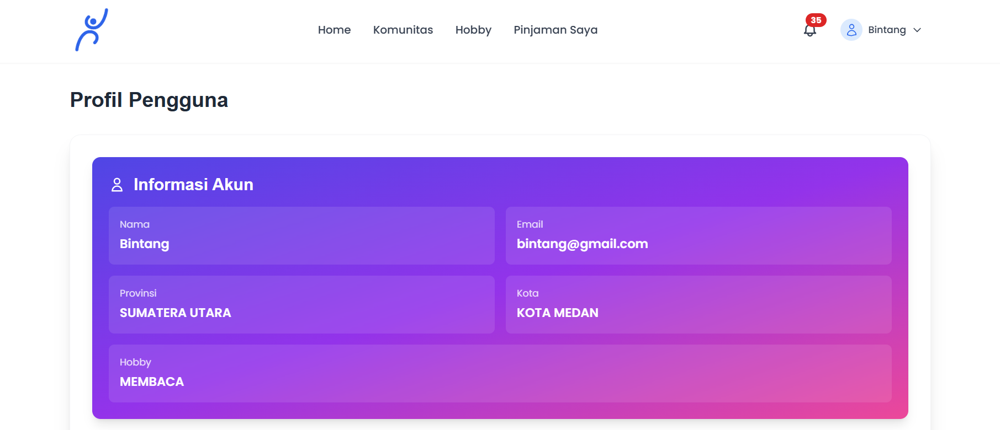

  
Halaman profil pengguna dengan data pribadi, rating, ulasan, dan pengaturan akun.

---

> 🏁 Proyek ini dikembangkan sebagai bagian dari **Capstone Project** dalam **Coding Camp 2025** yang diselenggarakan oleh **DBS Foundation**.
