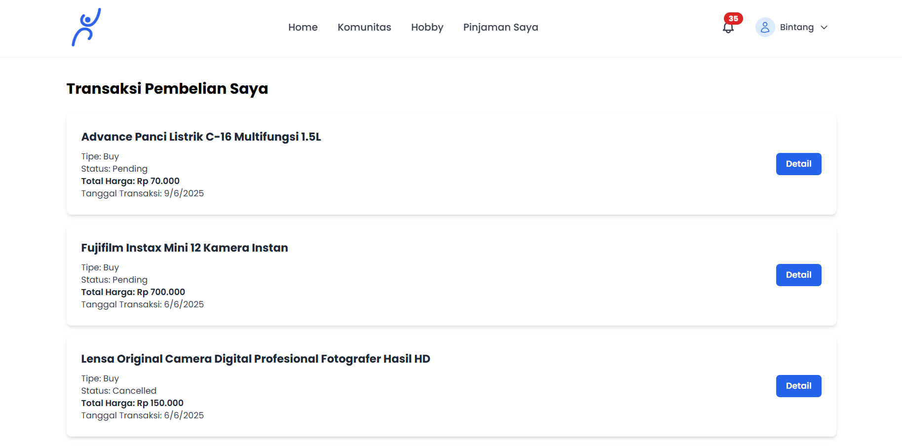

# 📦 Pinjemin

**Pinjemin** adalah aplikasi web inovatif yang menggabungkan fitur e-commerce dan penyewaan barang dalam satu platform. Dengan satu akun, pengguna dapat **menyewakan, meminjam, dan membeli** barang secara fleksibel dan efisien. Aplikasi ini dirancang untuk menciptakan ekosistem jual-beli dan sewa yang **user-friendly**, aman, dan mendukung transaksi berbasis lokasi secara langsung.

---

## 🚀 Fitur Unggulan

* 🔐 **Satu Akun untuk Semua** – Satu akun bisa digunakan untuk mengunggah produk, menyewa, membeli, dan melakukan checkout.
* 📤 **Upload Produk Fleksibel** – Pengguna dapat menawarkan barang untuk **dijual**, **disewakan**, atau keduanya.
* 🛒 **Checkout Terintegrasi** – Proses checkout mendukung transaksi **jual-beli dan sewa secara bersamaan**.
* 🤝 **Transaksi COD (Cash on Delivery)** – Pembayaran dilakukan secara langsung saat penyerahan barang.
* 📜 **Riwayat & Notifikasi Transaksi** – Semua aktivitas pengguna tercatat, dilengkapi dengan **notifikasi real-time**.
* 🌟 **Penilaian & Ulasan Pengguna** – Fitur rating dan review untuk meningkatkan kepercayaan antar pengguna.
* 💬 **Komentar & Obrolan Langsung** – Komunikasi langsung antar pengguna dalam satu platform.
* 📍 **Lokasi & Janjian Pengambilan** – Tentukan tempat dan waktu pengambilan/penyerahan barang dengan mudah.
* ⏰ **Pengingat Pengembalian Otomatis** – Sistem akan memberikan notifikasi saat batas waktu penyewaan mendekat.
* 🔍 **Pencarian Cerdas** – Fitur pencarian dengan filter detail untuk memudahkan pengguna menemukan barang sesuai kebutuhan.
* 🗺️ **Peta Interaktif Real-Time** – Navigasi berbasis peta untuk memudahkan pencarian lokasi pengguna atau produk.

---

## 👥 Tim Pengembang

### 🎯 Machine Learning Team

* **MC008D5X0402** – Rahma Nur Annisa
  *Statistika, Universitas Gadjah Mada*

* **MC008D5Y0259** – Yohanes De Britto Dewo Prasetyo
  *Statistika, Universitas Gadjah Mada*

* **MC008D5Y1074** – Dimaz Andhika Putra
  *Statistika, Universitas Gadjah Mada*

### 🖥️ Front-End & Back-End Team

* **FC221D5Y1035** – Bintang Kurniawan Herman
  *Ilmu Komputer, UIN Sumatera Utara Medan*

* **FC134D5X1508** – Indah Sari Sitorus
  *Manajemen Informatika, Politeknik Negeri Sriwijaya*

* **FC014D5Y0292** – I Putu Yogi Prasetya Dharmawan
  *Teknologi Informasi, Universitas Udayana*

---

## 📂 Repositori GitHub

* **Front-End**: [github.com/bintangawan/frontend-pinjemin](https://github.com/bintangawan/frontend-pinjemin)
* **Back-End**: [github.com/bintangawan/backend-pinjemin](https://github.com/bintangawan/backend-pinjemin)
* **Machine Learning**: [github.com/bintangawan/backend-ml-pinjemin](https://github.com/bintangawan/backend-ml-pinjemin.git)
* **Machine Learning Express**: [github.com/bintangawan/exml-pinjemin](https://github.com/bintangawan/exml-pinjemin.git)

---

## 📱 Tampilan Aplikasi

### 🏠 Landing Page

Halaman awal aplikasi yang menampilkan informasi utama tentang fitur, manfaat, dan ajakan untuk mendaftar atau masuk. Desain menarik untuk menarik perhatian pengguna sejak pertama kali mengakses.

---

### 📝 Register

Formulir pendaftaran akun baru dengan antarmuka ramah pengguna. Mendukung pendaftaran melalui email maupun akun media sosial.

---

### 🔑 Login

Tampilan login yang sederhana namun aman, memberikan akses cepat ke akun pengguna.

---

### 🏠 Home Page

Dashboard utama yang menampilkan produk populer, kategori, dan rekomendasi personal. Navigasi intuitif memudahkan pengguna menjelajahi fitur yang tersedia.

---

### 🔍 Search & Product Recommendation

Pencarian pintar dengan filter lengkap berdasarkan kategori, lokasi, harga, dan ketersediaan. Dilengkapi rekomendasi produk yang dipersonalisasi menggunakan algoritma machine learning.

---

### 📦 Detail Item

Menampilkan informasi lengkap produk, termasuk deskripsi, harga beli/sewa, durasi, kondisi barang, serta ulasan dari pengguna sebelumnya.

---

### 🧩 Product Recommendation

Fitur rekomendasi lanjutan yang menyarankan produk sejenis atau pelengkap berdasarkan aktivitas pengguna sebelumnya.

---

### 👥 Community

Forum komunitas tempat pengguna dapat saling berdiskusi, berbagi pengalaman, dan membangun relasi dalam ekosistem Pinjemin.

---

### 🎯 Hobby

Koleksi produk berdasarkan minat dan hobi pengguna, memudahkan pencarian barang sesuai kegemaran pribadi.

---

### ➕ Add Item

Formulir unggah produk yang ringkas dan jelas. Pengguna dapat menentukan apakah barang akan disewakan, dijual, atau keduanya.

---

### 📋 Daftar Item

Inventaris pribadi pengguna, menampilkan status masing-masing barang (tersedia, disewa, terjual) dengan kontrol edit dan hapus.

---

### 🛒 Buyer Page

Dashboard khusus pembeli, menampilkan riwayat transaksi, status pesanan, serta jadwal pengambilan dan pengembalian.

---

### 💼 Seller Page

Panel untuk penjual yang berisi statistik, permintaan pembeli/penyewa, serta notifikasi terkini.

---

### 👤 Profile Page

Halaman profil pengguna dengan data pribadi, rating, ulasan, dan pengaturan akun.

---

> 🏁 Proyek ini dikembangkan sebagai bagian dari **Capstone Project** dalam **Coding Camp 2025** yang diselenggarakan oleh **DBS Foundation**.
